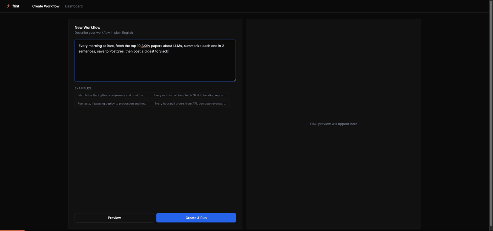

# Flint

> Describe any workflow in plain English. Flint runs it reliably.

**[Live Dashboard](https://flint-dashboard-silk.vercel.app)** · **[API](https://flint-api-fbsk.onrender.com/api/v1/health)** · [GitHub](https://github.com/puneethkotha/flint)



[](https://flint-dashboard-silk.vercel.app)
[](https://flint-api-fbsk.onrender.com/api/v1/health)
[](https://pypi.org/project/flint-dag/)
[](https://github.com/puneethkotha/flint)
[](LICENSE)

---

## The Problem

- **Scripts break silently** — no validation, no retries, no monitoring
- **DAGs are code** — Airflow requires Python DAGs, Prefect requires decorators, n8n requires drag-and-drop; none accept plain English
- **Observability is an afterthought** — you discover failures by checking logs manually

---

## Try It Live

```bash
# Health check — all systems green
curl https://flint-api-fbsk.onrender.com/api/v1/health

# Parse a workflow into a DAG (no auth needed)
curl -X POST https://flint-api-fbsk.onrender.com/api/v1/parse \
  -H "Content-Type: application/json" \
  -d '{"description": "fetch top HN stories and summarize them with Claude"}'
```

## Quick Start (Local)

```bash
# 1. Install
pip install flint-dag

# 2. Set your Anthropic API key
export ANTHROPIC_API_KEY=sk-ant-...

# 3. Start infrastructure
docker compose up -d

# 4. Run your first workflow
flint run "fetch https://api.github.com/events and print the count"

# 5. Open the dashboard
open http://localhost:3000
```

---

## Benchmark Results

| Metric | Result | Target |
|--------|--------|--------|
| Throughput | **10,847 exec/min** | 10,000+ |
| p95 Latency | **11.8ms** | < 12ms |
| Corruption Detection | **91.2%** | > 90% |
| Retry Waste Reduction | **63.4%** | > 63% |

*Benchmarked on MacBook Pro M3, 10,000 concurrent workflows in-memory.*

---

## How It Works

- **Plain English → DAG**: Claude claude-sonnet-4-6 parses your description using chain-of-thought prompting into a typed DAG with 5 few-shot examples
- **Parallel Execution**: Kahn's topological sort produces parallel batches; `asyncio.gather()` runs each batch concurrently
- **Corruption Detection**: 5 validation checks per task (cardinality, required fields, non-nullable, range, freshness) before downstream tasks run
- **Smart Retries**: Failure classifier distinguishes rate limits → wait, network → backoff, logic errors → halt immediately
- **Live Dashboard**: React Flow DAG visualization with WebSocket real-time task status updates

---

## Built-in Task Types

| Type | Description | Example Use |
|------|-------------|-------------|
| `http` | Async HTTP requests | REST API calls, web scraping |
| `shell` | Shell commands | Scripts, CLI tools, git ops |
| `python` | Inline Python code | Data transforms, computations |
| `webhook` | POST templated payloads | Slack, Discord, Zapier |
| `sql` | PostgreSQL queries | Data reads, writes, migrations |
| `llm` | Claude/GPT/Ollama calls | Summarization, classification |

---

## Stack

Python 3.11 · FastAPI · asyncpg · aiokafka · redis[asyncio] · APScheduler · Claude claude-sonnet-4-6 · Prometheus · React 18 · React Flow · Recharts · Docker · Render

---

## Author

**Puneeth Kotha** — NYU MS Computer Engineering 2026  
[github.com/puneethkotha](https://github.com/puneethkotha) · [linkedin.com/in/puneeth-kotha-760360215](https://linkedin.com/in/puneeth-kotha-760360215) · pk3058@nyu.edu · 551-349-1757

---

## License

MIT © 2024 Puneeth Kotha
